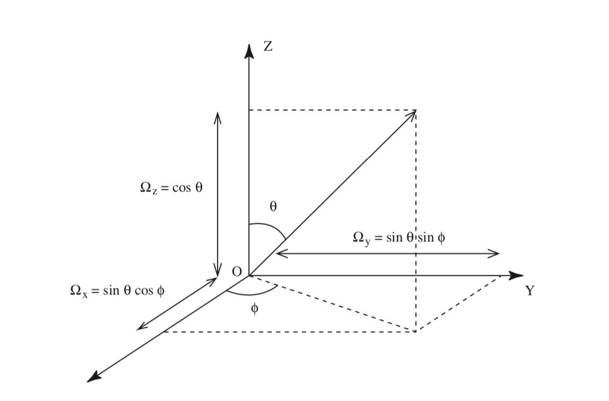
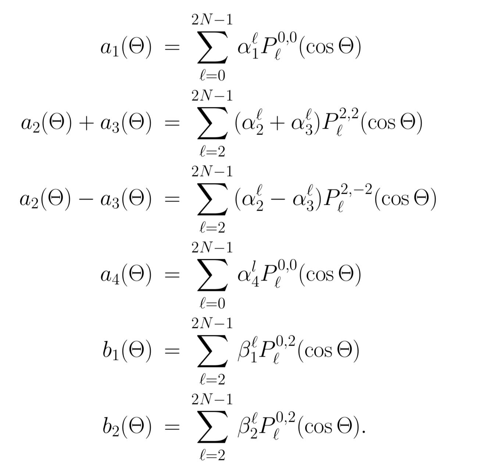
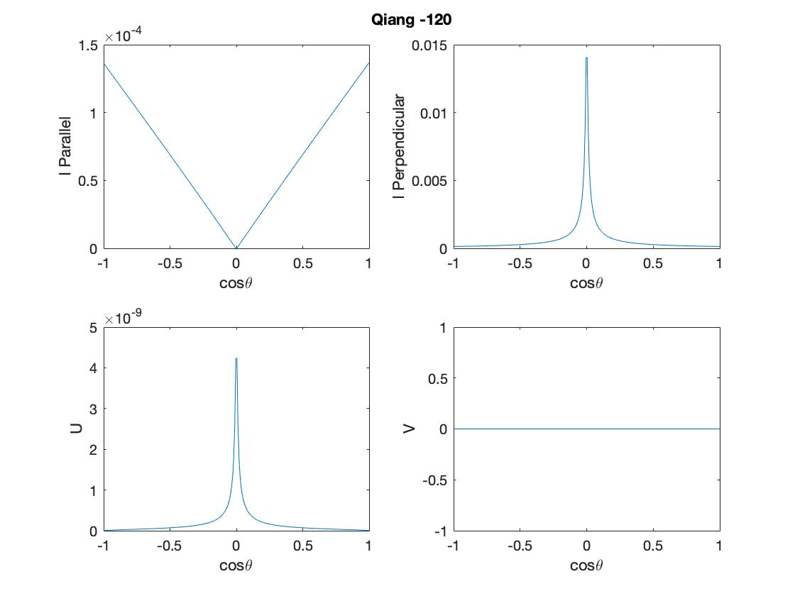
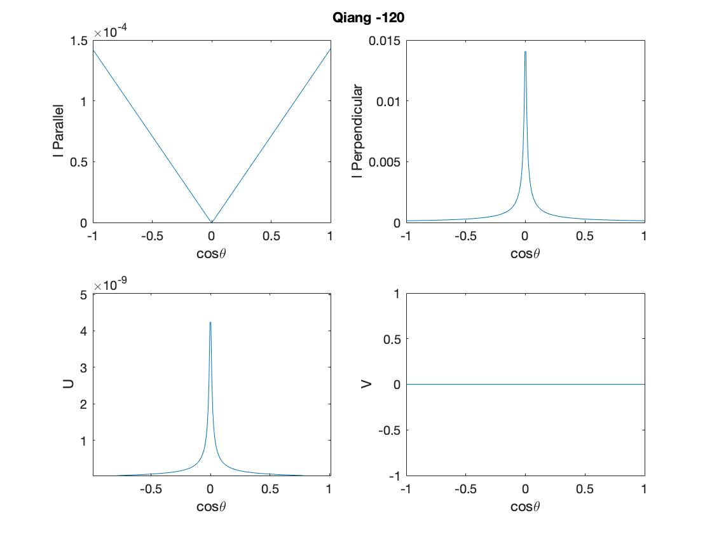

# Single Scattering Albedo

The single scattering albedo is $$a=1$$ , and the total optical depth $$\tau^{\star}=0.01$$ . The setting satisfies single-scattering approximation, $$a \times \tau^{\star}=0.01\ll1$$. The incident solar flux is a unpolarized light, $$F=[0.5, 0.5, 0, 0]$$. In the following case example, the angles are set as follows, $$\theta^{\prime}=0^{o}, \mu^{\prime}=1, \phi^{\prime}=0^{o} ; \theta=\left[0^{o}, 180^{\circ}\right], \mu=[-1,1], \phi=60^{o} $$, where  $$\theta^{\prime}, \phi^{\prime}$$ are the polar angle and azimuth angle of the incident light $$\Omega^{\prime}$$ , and the $$\theta , \phi$$ are for the corresponding observe angles $$\Omega$$ . 

```python
a = 1;
tau = 0.01;
F = [.5;.5;0;0];

thetap = 0.00001;
mup = cos(thetap*pi/180);

phip = 0;
phi = 60;
```

Compute the Legendre-Gauss nodes \( $$ctheta$$ \) and weights \( $$Weight$$ \) on an interval \[-1,1\] with truncation order nthetas \( $$ntheta=400$$ \) using an outside function `lgwt`, and retrieve the corresponding $$thetas$$. Function `lgwt` takes integral using Legendre-Gauss Quadrature.

```python
nthetas = 400;

[ctheta, Weight] = lgwt(nthetas,-1,1);
theta = acos(ctheta)*180/pi;
```

The angle $$\Theta$$ between the directions of incidence $$\Omega$$ and observation $$\Omega^{\prime}$$ is given by

$$
\cos \Theta=\cos \theta^{\prime} \cos \theta+\sin \theta^{\prime} \sin \theta \cos \left(\phi^{\prime}-\phi\right)
$$



There are two representations for the phase matrix, $$\mathbf{P}_{S}$$ and $$\mathbf{P}_{C}$$, where $$\mathbf{P}_{S}$$ is used for the Stocks vector representation $$\mathbf{I}_{S}=[I, Q, U, V]^{T}$$, and  $$\mathbf{P}_{C}$$ is for $$\mathbf{I}=\left[I_{ \|}, I_{\perp}, U, V\right]^{T}$$ representation \(or Chandrasekhar's representation\). The connection between these two representations is simply $$\mathbf{I}_{S} = \mathbf{DI}_{C}$$ , where the matrix $$\mathbf{D}$$ is given by:

$$
\mathbf{D} \equiv\left(\begin{array}{cccc}{1} & {1} & {0} & {0} \\ {1} & {-1} & {0} & {0} \\ {0} & {0} & {1} & {0} \\ {0} & {0} & {0} & {1}\end{array}\right)
$$

The phase matrix $$\mathbf{P}_{C}$$ in $$\mathbf{I}_{C}=\left[I_{ \|}, I_{\perp}, U, V\right]^{T}$$ representation is related to the phase matrix $$\mathbf{P}_{S}$$ in $$\mathbf{I}_{S}=[I, Q, U, V]^{T}$$ as $$\mathbf{P}_{C}=\mathbf{D}^{-1} \mathbf{P}_{S} \mathbf{D}$$, and $$\mathbf{D}^{-1}$$is given by:

$$
\mathbf{D}^{-1}=\left(\begin{array}{cccc}{\frac{1}{2}} & {\frac{1}{2}} & {0} & {0} \\ {\frac{1}{2}} & {-\frac{1}{2}} & {0} & {0} \\ {0} & {0} & {1} & {0} \\ {0} & {0} & {0} & {1}\end{array}\right)
$$

 

```python
cTheta = mup*ctheta+sqrt((1-mup^2)*(1-ctheta.^2))*cos((phip-phi)/180*pi);
Theta = acos(cTheta)*180/pi;

D = [1 1 0 0;...
    1 -1 0 0;...
    0 0 1 0;...
    0 0 0 1];
```

In this test case, we only include one wavelength at 500 nm, number of moment 300+1, and load the six columns of greek constants from `Mie_tool output` file, without delta fit.

```python
number of wavelength
numwl = 1;
% number of moment
nmom = 300+1;

fname1 = 'mie_output_small2.dat';
fid1 = fopen(fname1);

rawdata1(1, :) = textscan(fid1, '%f %f %f %f %f %f', nmom, 'headerLines', 3);
% rawdata1(2, :) = textscan(fid1, '%f %f %f %f %f %f', nmom, 'headerLines', 4);
% rawdata1(3, :) = textscan(fid1, '%f %f %f %f %f %f', nmom, 'headerLines', 4);
% rawdata1(4, :) = textscan(fid1, '%f %f %f %f %f %f', nmom, 'headerLines', 4);
% rawdata1(5, :) = textscan(fid1, '%f %f %f %f %f %f', nmom, 'headerLines', 4);
% rawdata1(6, :) = textscan(fid1, '%f %f %f %f %f %f', nmom, 'headerLines', 4);
% rawdata1(7, :) = textscan(fid1, '%f %f %f %f %f %f', nmom, 'headerLines', 4);


fclose(fid1);
rawdata2 = cell2mat(rawdata1);
data2 = zeros(nmom, 6, numwl);
```

The expression for the Fourier coefficients can be written as

$$
\mathbf{A}^{m}\left(\tau, u^{\prime}, u\right)=\sum_{\ell=m}^{2 N-1} \mathbf{P}_{\ell}^{m}(u) \boldsymbol{\Lambda}_{\ell}(\tau) \mathbf{P}_{\ell}^{m}\left(u^{\prime}\right)
$$

where 

$$
\boldsymbol{\Lambda}_{\ell}(\tau)=\left(\begin{array}{cccc}{\alpha_{1}^{\ell}} & {\beta_{1}^{\ell}} & {0} & {0} \\ {\beta_{1}^{\ell}} & {\alpha_{2}^{\ell}} & {0} & {0} \\ {0} & {0} & {\alpha_{3}^{\ell}} & {\beta_{2}^{\ell}} \\ {0} & {0} & {-\beta_{2}^{\ell}} & {\alpha_{4}^{\ell}}\end{array}\right)
$$

The matrices $$P_{\ell}^{m}( \pm \mu)$$ are defined through 

$$
\mathbf{P}_{\ell}^{m}(u)=\left(\begin{array}{cccc}{P_{\ell}^{m, 0}(u)} & {0} & {0} & {0} \\ {0} & {P_{\ell}^{m,+}(u)} & {P_{\ell}^{m,-}(u)} & {0} \\ {0} & {P_{\ell}^{m,-}(u) P_{\ell}^{m,+}(u)} & {0} \\ {0} & {0} & {0} & {P_{\ell}^{m, 0}(u)}\end{array}\right)
$$

with $$P_{\ell}^{m, \pm}(u)=\frac{1}{2}\left[P_{\ell}^{m,-2}(u) \pm P_{\ell}^{m, 2}(u)\right]$$ The functions $$P_{\ell}^{m, 0}(u) $$ and $$P_{\ell}^{m, \pm 2}(u)$$  __ are the generalized spherical functions. 

We define $$P_{\ell}^{m,n}(u)=0 \quad \text { for } \ell<\max \{|m|,|n|\}$$.

For  $$\ell>\max \{|m|,|n|\}$$ the functions are calculated as follows \( $$i$$ is the imaginary unit \).

$$
\begin{aligned} P_{m}^{m, 0}(u)=(2 i)^{-m}\left[\frac{(2 m) !}{m ! m !}\right]^{1 / 2}\left(1-u^{2}\right)^{m / 2} \quad(m \geq 0) \end{aligned}
\\
\begin{aligned} P_{2}^{0, \pm 2}(u)=\frac{-1}{4} \sqrt{6}\left(1-u^{2}\right) \quad(m=0)\end{aligned}
\\
\begin{aligned} P_{2}^{1, \pm 2}(u)=\pm(2 i)^{-1}\left(1-u^{2}\right)^{1 / 2}(1 \pm u) \quad(m=1)\end{aligned}
\\
\begin{aligned} P_{m}^{m, \pm 2}(u)=&-(2 i)^{-m}\left[\frac{(2 m) !}{(m+2) !(m-2) !}\right]^{1 / 2} \times(1-u)^{(m \mp 2) / 2}(1+u)^{(m \pm 2) / 2} \quad(m \geq 2) \end{aligned}
$$

and the recurrence relations 

$$
\sqrt{(\ell+1)^{2}-m^{2}} P_{\ell+1}^{m, 0}(u)=(2 \ell+1) u P_{\ell}^{m, 0}(u)-\sqrt{\ell^{2}-m^{2}} P_{\ell-1}^{m, 0}(u)
$$

The equations above are taken from de Hann's 1987 paper, `eq. 74 to 81`, in $$\textit{The adding method for multiple scattering calculations of polarized light}$$. [http://articles.adsabs.harvard.edu//full/1987A%26A...183..371D/0000378.000.html](http://articles.adsabs.harvard.edu//full/1987A%26A...183..371D/0000378.000.html)

The rotations of reference plane are implicitly accounted for in the expansion method. In the following code, `line 3~line6` uses functions defined outside. 

`plm0` calculates cases with m=0 and n=0, `plm2` calculates cases with m=2 and n=2, `plmn2` calculates cases with m=2, n=-2, and `plm2` calculates cases with m=0 and n=2.

```python
nterms = length(data2);

p00 = plm0(0,nterms-1,ctheta);           % m=0, n=0
p22 = plm2(2,nterms-1,ctheta);           % m=2, n=2
p2n2 = plmn2(2,nterms-1,ctheta); %P subscript m=2, n=-2
p02 = plm2(0,nterms-1,ctheta); %P subscript m=0, n=2
```

Read in the phase moments from the `'mie_output_small2.dat'` file to alphas and betas \(`line 2~8`\). Suppressing the $$a = b$$ dependence, the following equations are for cases of non-spherical particles.



  
The general form of Stokes scattering matrix Fs \(which is the ensemble-averaged Mueller matrix averaging over a small volume containing an ensemble of particles\) is of the form: 

$$
\mathbf{F}_{S}(\Theta)=\left(\begin{array}{cccc}{a_{1}(\Theta)} & {b_{1}(\Theta)} & {0} & {0} \\ {b_{1}(\Theta)} & {a_{2}(\Theta)} & {0} & {0} \\ {0} & {0} & {a_{3}(\Theta)} & {b_{2}(\Theta)} \\ {0} & {0} & {-b_{2}(\Theta)} & {a_{4}(\Theta)}\end{array}\right)
$$

Note that there are six independent elements for non-spherical particles. 

```python
for i = 1:1        %1:numwl
    data2(:, :, i) = rawdata2((1+nmom*(i-1):nmom*i), 1:end);
    alpha1(:, i, 2) = data2(:, 1, i);
    alpha2(:, i, 2) = data2(:, 2, i);
    alpha3(:, i, 2) = data2(:, 3, i);
    alpha4(:, i, 2) = data2(:, 4, i);
    beta1(:, i, 2) = data2(:, 5, i);
    beta2(:, i, 2) = data2(:, 6, i);
    
    a1(:, i, 1) = alpha1(:,i, 2)' * p00; % Eq.68
    a4(:, i, 1) = alpha4(:,i, 2)' * p00; % Eq.71
    b1(:, i, 1) = beta1(:,i, 2)' * p02; % Eq.72
    b2(:, i, 1) = beta2(:,i, 2)' * p02; % Eq.73
    a2(:, i, 1) = .5*((alpha2(:,i, 2) + alpha3(:,i, 2))' * p22 + (alpha2(:,i, 2) - alpha3(:,i, 2))' * p2n2); %Eq.69+70
    a3(:, i, 1) = .5*((alpha2(:,i, 2) + alpha3(:,i, 2))' * p22 - (alpha2(:,i, 2) - alpha3(:,i, 2))' * p2n2); %Eq.69+70
end
```

If we want to study spherical particles, there are four independent components, $$a_{1}(\Theta), a_{3}(\Theta), b_{1}(\Theta), b_{2}(\Theta)$$ , given $$a_{2}(\Theta)=a_{1}(\Theta), a_{4}(\Theta)=a_{1}(\Theta).$$ 

The code should be adjusted as follows 

$$
\mathbf{F}_{S}(\Theta)=\left(\begin{array}{cccc}{a_{1}(\Theta)} & {b_{1}(\Theta)} & {0} & {0} \\ {b_{1}(\Theta)} & {a_{1}(\Theta)} & {0} & {0} \\ {0} & {0} & {a_{3}(\Theta)} & {b_{2}(\Theta)} \\ {0} & {0} & {-b_{2}(\Theta)} & {a_{3}(\Theta)}\end{array}\right)
$$

```python
for i = 1:1        %1:numwl
    data2(:, :, i) = rawdata2((1+nmom*(i-1):nmom*i), 1:end);
    alpha1(:, i, 2) = data2(:, 1, i);
    alpha2(:, i, 2) = data2(:, 2, i);
    alpha3(:, i, 2) = data2(:, 3, i);
    alpha4(:, i, 2) = data2(:, 4, i);
    beta1(:, i, 2) = data2(:, 5, i);
    beta2(:, i, 2) = data2(:, 6, i);
    
    a1(:, i, 1) = alpha1(:,i, 2)' * p00; % Eq.68
    a4(:, i, 1) = alpha4(:,i, 2)' * p00; % Eq.71
    b1(:, i, 1) = beta1(:,i, 2)' * p02; % Eq.72
    b2(:, i, 1) = beta2(:,i, 2)' * p02; % Eq.73
    a2(:, i, 1) = a1(:,i, 1) 
    a3(:, i, 1) = a4(:,i, 1) 
end
```


Note:

In here, a more precise way to do it is to output the a1 to a4 and b1, b2 directly from the mie code. The method above, to compute them from alpha1~alpha4 and beta1 beta2 is actually taking a detour.  


So far, we have calculated the scattering matrix $$\mathbf{F}_{S}$$. The phase matrix $$\mathbf{P}_{S}$$ is related to the scattering matrix by  $$\mathbf{P}_{S}\left(u^{\prime}, \phi^{\prime}, u, \phi\right)=\mathbf{R}_{S}\left(\pi-\sigma_{2}\right) \mathbf{F}_{S}(\Theta) \mathbf{R}_{S}\left(-\sigma_{1}\right)$$. $$\mathbf{R}_{S}$$ is a rotation matrix used to rotate reference planes, and it transforms phase matrix from the scattering plane to local meridian plane of reference. 

$$
\mathbf{R}_{S}(\eta)=\left[\begin{array}{cccc}{1} & {0} & {0} & {0} \\ {0} & {\cos (2 \eta)} & {-\sin (2 \eta)} & {0} \\ {0} & {\sin (2 \eta)} & {\cos (2 \eta)} & {0} \\ {0} & {0} & {0} & {1}\end{array}\right]
$$

Then use $$\mathbf{P}_{C}=\mathbf{D}^{-1} \mathbf{P}_{S} \mathbf{D}$$ \(`line 10` in the following code snippet\).

 $$\mathbf{F}_{C}(\Theta)=\mathbf{D}^{-1} \mathbf{F}_{S}(\Theta) \mathbf{D}$$, where  $$\mathbf{F}_{C}(\Theta)$$ is the Chandrasekhar's Stocks vector representation.

Another way to find $$\mathbf{P}_{C}$$ is by first finding the transformed rotation matrix elements $$\tilde{\mathbf{R}}_{S}\left(\pi-\sigma_{2}\right)$$ and $$\tilde{\mathbf{R}}_{S}\left(-\sigma_{1}\right)$$, and  $$\mathbf{P}_{C}=\tilde{\mathbf{R}}_{S} (\pi-\sigma_{2})\mathbf{P}_{S} \tilde{\mathbf{R}}_{S}(-\sigma_{1})$$**.** 


The radiative transfer equitation for diffuse polarized radiation, described in terms of the Stokes equations is given by

$$
\mu \frac{d \vec{I}(\tau, \mu, \phi)}{d \tau}=\vec{I}(\tau, \mu, \phi)-\frac{a(\tau)}{4 \pi} \int_{0}^{2 \pi} d \phi^{\prime} \int_{-1}^{1} d \mu^{\prime} \vec{P}\left(\tau, \mu, \phi ; \mu^{\prime}, \phi^{\prime}\right) \vec{I}\left(\tau, \mu^{\prime}, \phi^{\prime}\right)+\vec{S}(\tau, \mu, \phi)
$$


Ignore the multiple-scattering term, we have $$\mu \frac{d \vec{I}(\tau, \mu, \phi)}{d \tau}=\vec{I}(\tau, \mu, \phi)+\vec{S}(\tau, \mu, \phi)$$ 

 The source term is defined as $$\vec{S}(\tau, \mu, \phi)=\frac{a(\tau) F^{s}}{4 \pi} \vec{P}\left(\mu^{\prime}, \phi^{\prime} ; \mu, \phi\right) e^{-\tau / \mu_{0}}$$ 


The diffused intensity in upward direction can be derived as $$\vec{I}_{d}^{+}(\tau, \mu, \phi)=\frac{a(\tau) \mu_{0} F^{s}}{4 \pi\left(\mu+\mu_{0}\right)} \vec{P}\left(\mu^{\prime}, \phi^{\prime} ; \mu, \phi\right)\left[e^{-\tau / \mu_{0}}-e^{-\left[\left(\tau^{*}-\tau\right) / \mu+\tau^{*} / \mu_{0}\right]}\right]$$ 

For the intensity at the top of the layer \( $$\tau=0$$ \), the above equation becomes 

$$
\vec{I}_{d}^{+}(0, \mu, \phi)=\frac{a(\tau) \mu_{0} F^{s}}{4 \pi\left(\mu+\mu_{0}\right)} \vec{P}\left(\mu^{\prime}, \phi^{\prime} ; \mu, \phi\right)\left[1-e^{-\left(\tau^{*} / \mu+\tau^{*} / \mu_{0}\right)}\right]
$$

Isolate the Azimuthal dependence, we get the Chandraskhar's representation of $$\vec{I}_{d}^{+}(\tau, \mu, \phi)$$ 

$$
\begin{aligned} \mathbf{I}(\tau, u, \phi)=& \sum_{m=0}^{2 N-1}\left\{\mathbf{I}_{c}^{m}(\tau, u) \cos m\left(\phi_{0}-\phi\right)+\mathbf{I}_{s}^{m}(\tau, u) \sin m\left(\phi_{0}-\phi\right)\right\} \\ \mathbf{Q}_{\delta}(\tau, u, \phi)=& \sum_{m=0}^{2 N-1}\left\{\mathbf{Q}_{c \delta}^{m}(\tau, u) \cos m\left(\phi_{0}-\phi\right)+\mathbf{Q}_{s \delta}^{m}(\tau, u) \sin m\left(\phi_{0}-\phi\right)\right\} \end{aligned}
$$

As for the Stocks representation, we just need to read out the  $$\vec{I}_{d}^{+}(0, \mu, \phi)$$ calculated using the equation from the above.

$$
\mathbf{I}_{C}=\left[I_{\ell}, I_{r}, U, V\right]^{T}=\mathbf{I}_{S}=\left[I_{ \|}, I_{\perp}, U, V\right]^{T}
$$

```python
for j = 1:length(phi)
    for i = 1:length(theta)
        Fs(:,:,(j-1)*181+i) = [a1(i,1), b1(i,1), 0, 0; b1(i,1), a2(i,1), 0, 0; 0, 0, a3(i,1), b2(i,1); 0, 0, -b2(i,1), a4(i,1)];

        [Rs1(:,:,(j-1)*181+i), Rs2(:,:,(j-1)*181+i)] = Rs(mup, ctheta(i), cTheta(i));

        Fc(:,:,(j-1)*181+i) = D^-1 * Fs(:,:,(j-1)*181+i) * D;        

        Ps(:,:,(j-1)*181+i) = Rs2(:,:,(j-1)*181+i) * Fs(:,:,(j-1)*181+i) * Rs1(:,:,(j-1)*181+i);
        Pc(:,:,(j-1)*181+i) = D^-1 * Ps(:,:,(j-1)*181+i) * D;
 
        Rs1_1(:,:,(j-1)*181+i) = D^-1 * Rs1(:,:,(j-1)*181+i) * D;
        Rs2_1(:,:,(j-1)*181+i) = D^-1 * Rs2(:,:,(j-1)*181+i) * D;        
        Pc_1(:,:,(j-1)*181+i) = Rs2_1(:,:,(j-1)*181+i) * Fc(:,:,(j-1)*181+i) * Rs1_1(:,:,(j-1)*181+i);

        Id(:,i,j) = a*mup/4/pi/(abs(ctheta(i))+mup)*(1-exp(-(tau/abs(ctheta(i))+tau/mup)))*Pc(:,:,(j-1)*181+i)*F;
        Im(j,i) = 1*(real(Id(1,i,j))+real(Id(2,i,j)));
        Qm(j,i) = 1*(real(Id(1,i,j))-real(Id(2,i,j)));
        Il(j,i) = real(Id(1,i,j));
        Ir(j,i) = real(Id(2,i,j));
        U(j,i) = real(Id(3,i,j));
        V(j,i) = real(Id(4,i,j));
    end
    
    ```
    some codes to plot the graphs
    ```
end
```

Now it's time to scale it to two-slab and multi-slab cases.

### Single Multi-layer Slab

For a multilayered slab the corresponding solution is

$$
\begin{aligned} \mathbf{I}_{p}^{+}(\tau, \mu, \phi)=& \frac{\mu_{0}}{\left(\mu_{0}+\mu\right)} \sum_{n=p}^{L}\left\{\mathbf{X}_{n}^{+}(\mu, \phi)\right.\\ &\left. \times\left[e^{-\left[\tau_{n-1} / \mu_{0}+\left(\tau_{n-1}-\tau\right) / \mu\right]}-e^{-\left[\tau_{n} / \mu_{0}+\left(\tau_{n}-\tau\right) / \mu\right]}\right]\right\} \end{aligned}
$$

with $$\tau_{n-1}$$ replaced by $$\tau$$ for n=p. p is the layer at which level that we are trying to evaluate, $$\tau_{p}$$is the optical depth from the top of the slab to the p-th layer, and n is the total number of layer. 

### Single, two-layer slab

 $$\tau$$ is the depth measured from the top slab to any layer p. The subscript numbers get larger as more layers are accumulated downwards. 

As an example, for a 2 layer slab, with $$\tau_{1}=0.0025, \tau_{2}=0.005, \text{and we are evaluating an optical depth at }\tau=0.0024, \text{which means }p=1,  \text{the equations are}$$ 

$$
\begin{array}{l}{I_{1}^{+}=\frac{\mu_{0}}{\left(\mu_{0}+\mu\right)} X_{1}\left(e^{-\frac{\tau}{\mu{0}}}-e^{-\left(\frac{\tau_{1}}{\mu_{0}}+\frac{\tau_{1}-\tau}{\mu}\right)}\right)} \\ \frac{\mu_{0}}{\left(\mu_{0}+\mu\right)} {+X_{2}\left(e^{-\left(\frac{\tau_{1}}{\mu_{0}}+\frac{\tau_{1}-\tau}{\mu}\right)}-e^{-\left(\frac{\tau_{2}}{\mu_{0}}+\frac{\tau_{2}-\tau}{\mu}\right)}\right)} \end{array}
$$

If evaluate on the bottom layer, say $$\tau=0.0026, \text{which means }p=2$$ 

$$
I_{2}^{+}=\frac{\mu_{0}}{\left(\mu_{0}+\mu\right)} X_{2}\left(e^{-\frac{\tau}{\mu_{0}}}-e^{-\left(\frac{\tau_{2}}{\mu_{0}}+\frac{\tau_{2}-\tau}{\mu}\right)}\right)
$$

Therefore, to achieve this functionality, just need to 

\(1\) Evaluate the range to know what p is  
\(2\) Loop from p to n





